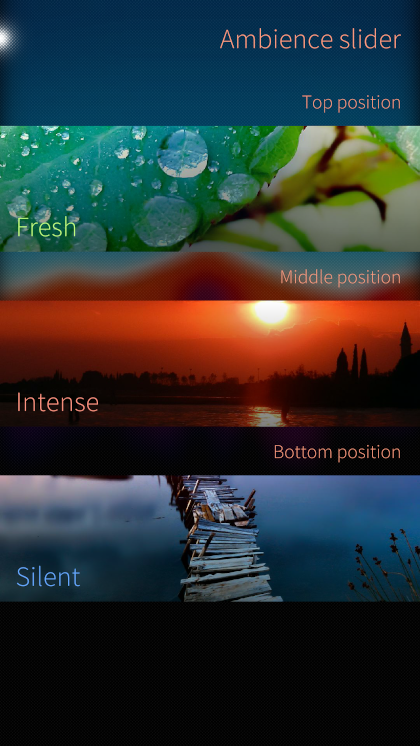
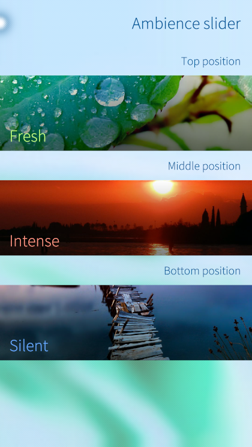

# onyx-triambience-settings-plugin
A fork of [@kimmoli](https://github.com/kimmoli)'s [original handy settings plugin](https://github.com/kimmoli/onyx-gesture-settings-plugin) for managing your three selected [triambience daemon](https://github.com/sailfishos-oneplus5/triambience-daemon) ambiences with minor tweaks and improvements.

## Screenshots

